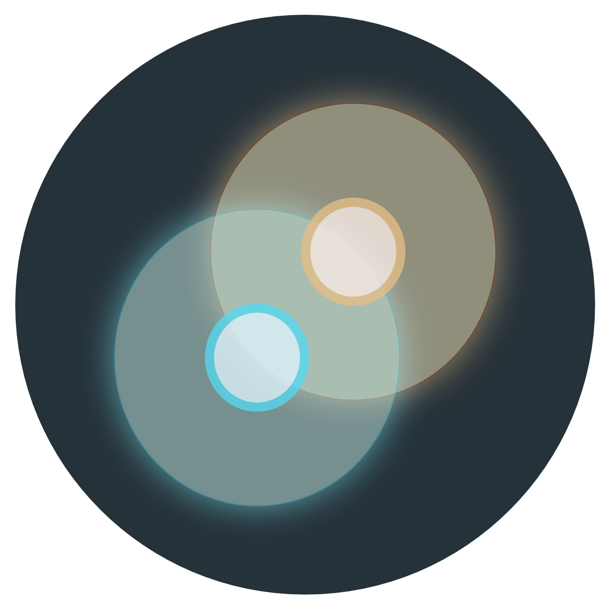

<h1 style="font-family:monospace, courier; font-size:3em">&nbsp;TAURI</h2>

[](https://github.com/tauri-apps/tauri/tree/dev)
[](https://opencollective.com/tauri)
[](https://github.com/tauri-apps/tauri/actions?query=workflow%3A%22test+library%22)

[](https://discord.gg/SpmNs4S)
[](https://dev.to/tauri)
[](https://tauri.studio/docs/getting-started/intro)
[](https://good-labs.github.io/greater-good-affirmation)
[](https://opencollective.com/tauri)

```yml
Tauri Apps
  footprint:   minuscule
  performance: ludicrous
  flexibility: gymnastic
  security:    hardened
```

## Current Releases

| Component | Description  | Version | Lin | Win | Mac |
|-----------|---------|------|-----|-----|-----|
| [**tauri.js CLI**](https://github.com/tauri-apps/tauri/tree/dev/cli/tauri.js) | create, develop and build apps | [](https://www.npmjs.com/package/tauri) |✅|✅|✅|
| [**tauri core**](https://github.com/tauri-apps/tauri/tree/dev/tauri)  | binding to the low level WEBVIEW   | [](https://crates.io/crates/tauri)|✅|✅|✅|
| [**tauri api**](https://github.com/tauri-apps/tauri/tree/dev/tauri-api)  | interface with the underlying OS | [](https://crates.io/crates/tauri-api) |✅|✅|✅ |
| [**tauri bundler**](https://github.com/tauri-apps/tauri/tree/dev/cli/tauri-bundler) | manufacture the final binaries | [](https://crates.io/crates/tauri-bundler)  |✅|✅|✅ |
| [**tauri utils**](https://github.com/tauri-apps/tauri/tree/dev/tauri-utils) | common tools for tauri| [](https://crates.io/crates/tauri-utils)  |✅|✅|✅ |
| [**tauri updater**](https://github.com/tauri-apps/tauri/tree/dev/tauri-updater) [WIP] | update the userland app | [](https://crates.io/crates/tauri-updater)  | | | |


## Introduction
Tauri is a framework for building tiny, blazing fast binaries for all major desktop platforms. Developers can integrate any front-end framework that compiles to HTML, JS and CSS for building their user interface. The backend of the application is a rust-sourced binary with an API that the front-end can interact with.

The user interface in Tauri apps currently leverages Cocoa/WebKit on macOS, gtk-webkit2 on Linux and MSHTML (IE10/11) or Webkit via Edge on Windows. **Tauri** uses (and contributes to) the MIT licensed project that you can find at [webview](https://github.com/webview/webview) and the [related webview organization](https://github.com/webview).


## Get Started
If you are interested in making a tauri-app, please visit the [documentation website](https://tauri.studio). This README is directed towards those who are interested in contributing to the core library. But if you just want a quick overview about where `tauri` is at in its development, here's a quick burndown:

#### App Bundles
- [x] App Icons
- [x] Build on MacOS (.app, .dmg)
- [x] Build on Linux (.deb, AppImage)
- [x] Build on Windows (.exe, .msi)
- [x] Copy Buffer
- [x] Device Notifications (toast)
- [ ] Self Updater (in progress)
- [ ] deeplink RPC (in progress)
- [ ] One-Time commands (coming soon)
- [ ] App Signing (coming soon)
- [ ] Frameless Mode (coming soon)
- [ ] Transparent Mode (coming soon)
- [ ] Multiwindow Mode (coming soon)
- [ ] Tray (coming soon)

#### API
- [x] setTitle - set the window title
- [x] command - make custom API interfaces
- [x] execute - STDOUT Passthrough with command invocation
- [x] open - open link in a browser
- [x] event - two part api consisting of `emit` and `listen`
- [x] httpRequest - command rust to make an http request
- [x] openDialog - native file chooser dialog
- [x] saveDialog - native file saver dialog
- [x] readDir - list files in a directory
- [x] createDir - create a directory
- [x] removeDir - remove a directory
- [x] removeFile - remove a file
- [x] renameFile - rename a file
- [x] copyFile - copy a file to a new destination
- [x] writeFile - write file to local filesystem
- [x] writeBinaryFile - write binary file to local filesystem
- [x] readBinaryFile - read binary file from local filesystem
- [x] readTextFile - read text file from local filesystem
- [ ] channel - stream constant data to the webview

### Security Features
- [x] localhost-free mode (:fire:)
- [x] Dynamic ahead of Time Compilation (dAoT) with functional tree-shaking
- [x] functional Address Space Layout Randomization
- [x] OTP salting of function names and messages at runtime
- [x] CSP Injection
- [ ] Frida-based harness for Post-Binary Analysis (in progress)

### Utilities
- [x] GH Action for creating binaries for all platforms
- [x] VS Code Extension
- [x] Tauri Core Plugins
- [ ] Update core dependencies automatically from the command line
- [ ] Rust-based CLI with deno binding

### Comparison between Tauri and Electron

| Detail | Tauri | Electron |
|--|--------|----------|
| Binary Size MacOS | 0.6 MB (1) | 47.7 MB |
| Memory Consumption MacOS | 13 MB | 34.1 MB |
| Interface Service Provider | Varies | Chromium |
| Backend Binding | Rust | Node.js (ECMAScript) |
| Underlying Engine | C/C++ | V8 (C/C++) |
| FLOSS | Yes | No |
| Multithreading | Yes | No |
| Bytecode Delivery | Yes | No |
| Can Render PDF | Yes | No |
| Multiple Windows | Soon | Yes |
| Auto Updater | Soon | Yes (2) |
| Cross Platform | Yes | Yes |
| Custom App Icon | Yes | Yes |
| Windows Binary | Yes | Yes |
| MacOS Binary | Yes | Yes |
| Linux Binary | Yes | Yes |
| iOS Binary | Soon | No |
| Android Binary | Soon | No |
| Localhost Server | Yes | Yes |
| No localhost option | Yes | No |
| Desktop Tray | Soon | Yes |
| Splashscreen | Yes | Yes |
| Sidecar Binaries | Yes | No |

#### Notes
1. This is the smallest known binary, depending on your framework the size may be different.
2. Electron has no native auto updater on Linux, but is offered by electron-packager

## Development

Tauri is a system composed of a number of moving pieces:

### Infrastructure
- git for code management
- github for project management
- github actions for CI and CD
- discord for discussions
- netlify-hosted documentation website

### Major Runtimes
- node.js for running the CLI (deno and pure rust are on the roadmap)
- cargo for testing, running the dev service, building binaries and as the runtime harness for the webview

### Major Languages
- typescript for the CLI
- javascript for the JS-side of the API
- rust for bindings, rust side of the API, harnesses
- C / obj-c for interfacing with the webviews

### Operating systems
Tauri core can be developed on Mac, Linux and Windows, but you are encouraged to use the latest possible operating systems and build tools for your OS.

### Contribution Flow
Before you start working on something, it is best to check if there is an existing issue first. Also it is a good idea to stop by the Discord guild and confirm with the team if it makes sense or if someone is already working on it. If you want to read more about this, please see [this page](https://github.com/tauri-apps/tauri/blob/dev/.github/CONTRIBUTING.md).

### Documentation
Documentation in a polyglot system is a tricky proposition. To this end, we prefer to use inline documentation of Rust code and at JSDoc in typescript / javascript code. We autocollect these and publish them using Docusaurus v2 and netlify. Here is the hosting repository for the documentation site: https://github.com/tauri-apps/tauri-docs

### Testing & Linting
Test all the things! We have a number of test suites, but are always looking to improve our coverage:
- Rust (`cargo test`) => sourced via inline `#[cfg(test)]` declarations
- TS (`jest`) => via spec files
- Smoke Tests (run on merges to latest)
- eslint, clippy

### CI/CD
We recommend you read this article to understand better how we run our pipelines: https://www.jacobbolda.com/setting-up-ci-and-cd-for-tauri/

## Organization
Tauri aims to be a sustainable collective based on principles that guide [sustainable
free and open software communities](https://sfosc.org). You can get involved in many ways.

This has been done with our best attempt at due diligence and in
respect of the original authors. Thankyou - this project would never have
been possible without your amazing contribution to open-source and we are
honoured to carry the torch further. Of special note:
- [zserge](https://github.com/zserge) for the original webview approach and
go bindings
- [Burtonago](https://github.com/burtonageo) for the Cargo Bundle prototype

## Contributing
Please make sure to read the [Contributing Guide](./.github/CONTRIBUTING.md)
before making a pull request.

Thank you to all the people who already contributed to Tauri!

Special thanks to the development team at Volentix Labs for the encouragement and support in the early phases of Tauri, notably Rhys Parry and Gregory Luneau.

## Semver
**tauri** is following [Semantic Versioning 2.0](https://semver.org/).

## Licenses
Code: (c) 2015 - present - Daniel Thompson-Yvetot, Lucas Nogueira, Tensor, Serge Zaitsev, George Burton and all the other amazing contributors.

MIT or MIT/Apache 2.0 where applicable.

Logo: CC-BY-NC-ND
- Original Tauri Logo Designs by [Daniel Thompson-Yvetot](https://github.com/nothingismagick) and [Guillaume Chau](https://github.com/akryum)
