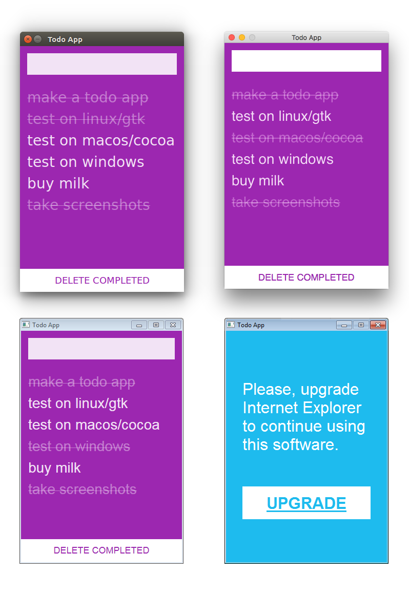

# webview

[](https://gitter.im/zserge/webview?utm_source=badge&utm_medium=badge&utm_campaign=pr-badge&utm_content=badge)
[](https://travis-ci.org/zserge/webview)
[](https://ci.appveyor.com/project/zserge/webview)
[](https://godoc.org/github.com/zserge/webview)
[](https://goreportcard.com/report/github.com/zserge/webview)


A tiny cross-platform webview library for C/C++/Golang to build modern cross-platform GUIs. Also, there are [Rust bindings](https://github.com/Boscop/webview-rs), [Python bindings](https://github.com/zserge/webview-python), [Nim bindings](https://github.com/oskca/webview), [Haskell](https://github.com/lettier/webviewhs) and [C# bindings](https://github.com/iwillspeak/webview-cs) available.

**IMPORTANT NOTE: Webview is now being rewritten from scratch, with the support of EdgeHTML and using C++14 as a primary language (code becomes much shorter/cleaner, and we still have C and Go APIs as the primary interface). Please have a look at [webview-x](https://github.com/zserge/webview/tree/webview-x) branch before opening new issues. Current version of webview is still maintained, PRs with bugfixes are welcome, but new functionality will be added to the new branch. I expect to finish the new branch before March 2019, but no hard deadlines.**

It supports two-way JavaScript bindings (to call JavaScript from C/C++/Go and to call C/C++/Go from JavaScript).

It uses Cocoa/WebKit on macOS, gtk-webkit2 on Linux and MSHTML (IE10/11) on Windows.

<p align="center"></p>

## Webview for Go developers

If you are interested in writing Webview apps in C/C++, [skip to the next section](#webview-for-cc-developers).

### Getting started

Install Webview library with `go get`:

```
$ go get github.com/zserge/webview
```

Import the package and start using it:

```go
package main

import "github.com/zserge/webview"

func main() {
	// Open wikipedia in a 800x600 resizable window
	webview.Open("Minimal webview example",
		"https://en.m.wikipedia.org/wiki/Main_Page", 800, 600, true)
}
```

It is not recommended to use `go run` (although it works perfectly fine on Linux). Use `go build` instead:

```bash
# Linux
$ go build -o webview-example && ./webview-example

# MacOS uses app bundles for GUI apps
$ mkdir -p example.app/Contents/MacOS
$ go build -o example.app/Contents/MacOS/example
$ open example.app # Or click on the app in Finder

# Windows requires special linker flags for GUI apps.
# It's also recommended to use TDM-GCC-64 compiler for CGo.
# http://tdm-gcc.tdragon.net/download
$ go build -ldflags="-H windowsgui" -o webview-example.exe
```

### API

See [godoc](https://godoc.org/github.com/zserge/webview).

### How to serve or inject the initial HTML/CSS/JavaScript into the webview?

First of all, you probably want to embed your assets (HTML/CSS/JavaScript) into the binary to have a standalone executable. Consider using [go-bindata](https://github.com/go-bindata/go-bindata) or any other similar tools.

Now there are two major approaches to deploy the content:

* Serve HTML/CSS/JS with an embedded HTTP server
* Injecting HTML/CSS/JS via the JavaScript binding API

To serve the content it is recommended to use ephemeral ports:

```go
ln, err := net.Listen("tcp", "127.0.0.1:0")
if err != nil {
	log.Fatal(err)
}
defer ln.Close()
go func() {
 	// Set up your http server here
	log.Fatal(http.Serve(ln, nil))
}()
webview.Open("Hello", "http://"+ln.Addr().String(), 400, 300, false)
```

Injecting the content via JS bindings is a bit more complicated, but feels more solid and does not expose any additional open TCP ports.

Leave `webview.Settings.URL` empty to start with bare minimal HTML5. It will open a webview with `<div id="app"></div>` in it. Alternatively, use a data URI to inject custom HTML code (don't forget to URL-encode it):

```go
const myHTML = `<!doctype html><html>....</html>`
w := webview.New(webview.Settings{
	URL: `data:text/html,` + url.PathEscape(myHTML),
})
```

Keep your initial HTML short (a few kilobytes maximum).

Now you can inject more JavaScript once the webview becomes ready using `webview.Eval()`. You can also inject CSS styles using JavaScript:

```go
w.Dispatch(func() {
	// Inject CSS
	w.Eval(fmt.Sprintf(`(function(css){
		var style = document.createElement('style');
		var head = document.head || document.getElementsByTagName('head')[0];
		style.setAttribute('type', 'text/css');
		if (style.styleSheet) {
			style.styleSheet.cssText = css;
		} else {
			style.appendChild(document.createTextNode(css));
		}
		head.appendChild(style);
	})("%s")`, template.JSEscapeString(myStylesCSS)))
	// Inject JS
	w.Eval(myJSFramework)
	w.Eval(myAppJS)
})
```

This works fairly well across the platforms, see `counter-go` example for more details about how make a webview app with no web server. It also demonstrates how to use ReactJS, VueJS or Picodom with webview.

### How to communicate between native Go and web UI?

You already have seen how to use `w.Eval()` to run JavaScript inside the webview. There is also a way to call Go code from JavaScript.

On the low level there is a special callback, `webview.Settings.ExternalInvokeCallback` that receives a string argument. This string can be passed from JavaScript using `window.external.invoke(someString)`.

This might seem very inconvenient, and that is why there is a dedicated `webview.Bind()` API call. It binds an existing Go object (struct or struct pointer) and creates/injects JS API for it. Now you can call JS methods and they will result in calling native Go methods. Even more, if you modify the Go object - it can be automatically serialized to JSON and passed to the web UI to keep things in sync.

Please, see `counter-go` example for more details about how to bind Go controllers to the web UI.

## Debugging and development tips

If terminal output is unavailable (e.g. if you launch app bundle on MacOS or
GUI app on Windows) you may use `webview.Debug()` and `webview.Debugf()` to
print logs. On MacOS such logs will be printed via NSLog and can be seen in the
`Console` app. On Windows they use `OutputDebugString` and can be seen using
`DebugView` app. On Linux logging is done to stderr and can be seen in the
terminal or redirected to a file.

To debug the web part of your app you may use `webview.Settings.Debug` flag. It
enables the Web Inspector in WebKit and works on Linux and MacOS (use popup menu
to open the web inspector). On Windows there is no easy to way to enable
debugging, but you may include Firebug in your HTML code:

```html
<script type="text/javascript" src="https://getfirebug.com/firebug-lite.js"></script>
```

Even though Firebug browser extension development has been stopped, Firebug
Lite is still available and just works.

## Distributing webview apps

On Linux you get a standalone executable. It will depend on GTK3 and GtkWebkit2, so if you distribute your app in DEB or RPM format include those dependencies. An application icon can be specified by providing a `.desktop` file.

On MacOS you are likely to ship an app bundle. Make the following directory structure and just zip it:

```
example.app
└── Contents
    ├── Info.plist
    ├── MacOS
    |   └── example
    └── Resources
        └── example.icns
```

Here, `Info.plist` is a [property list file](https://developer.apple.com/library/content/documentation/General/Reference/InfoPlistKeyReference/Articles/AboutInformationPropertyListFiles.html) and `*.icns` is a special icon format. You may convert PNG to icns [online](https://iconverticons.com/online/).

On Windows you probably would like to have a custom icon for your executable. It can be done by providing a resource file, compiling it and linking with it. Typically, `windres` utility is used to compile resources.

You may find some example build scripts for all three platforms [here](https://github.com/naivesound/glitch/tree/master/dist).

Also, if you want to cross-compile your webview app - use [xgo](https://github.com/karalabe/xgo).

## Webview for C/C++ developers

### Getting started

Download [webview.h](https://raw.githubusercontent.com/zserge/webview/master/webview.h) and include it in your C/C++ code:

```c
// main.c
#define WEBVIEW_IMPLEMENTATION
#include "webview.h"

#ifdef WIN32
int WINAPI WinMain(HINSTANCE hInt, HINSTANCE hPrevInst, LPSTR lpCmdLine,
                   int nCmdShow) {
#else
int main() {
#endif
  /* Open wikipedia in a 800x600 resizable window */
  webview("Minimal webview example",
	  "https://en.m.wikipedia.org/wiki/Main_Page", 800, 600, 1);
  return 0;
}
```

Build it:

```bash
# Linux
$ cc main.c -DWEBVIEW_GTK=1 `pkg-config --cflags --libs gtk+-3.0 webkit2gtk-4.0` -o webview-example
# MacOS
$ cc main.c -DWEBVIEW_COCOA=1 -framework WebKit -o webview-example
# Windows (mingw)
$ cc main.c -DWEBVIEW_WINAPI=1 -lole32 -lcomctl32 -loleaut32 -luuid -mwindows -o webview-example.exe
```

### API

For the most simple use cases there is only one function:

```c
int webview(const char *title, const char *url, int width, int height, int resizable);
```

The following URL schemes are supported:

* `http://` and `https://`, no surprises here.
* `file:///` can be useful if you want to unpack HTML/CSS assets to some
  temporary directory and point a webview to open index.html from there.
* `data:text/html,<html>...</html>` allows to pass short HTML data inline
  without using a web server or polluting the file system. Further
  modifications of the webview contents can be done via JavaScript bindings.

If have chosen a regular http URL scheme, you can use Mongoose or any other web server/framework you like.

If you want to have more control over the app lifecycle you can use the following functions:

```c
  struct webview webview = {
      .title = title,
      .url = url,
      .width = w,
      .height = h,
      .debug = debug,
      .resizable = resizable,
  };
  /* Create webview window using the provided options */
  webview_init(&webview);
  /* Main app loop, can be either blocking or non-blocking */
  while (webview_loop(&webview, blocking) == 0);
  /* Destroy webview window, often exits the app */
  webview_exit(&webview);

  /* To change window title later: */
  webview_set_title(&webview, "New title");

  /* To terminate the webview main loop: */
  webview_terminate(&webview);

  /* To print logs to stderr, MacOS Console or DebugView: */
  webview_debug("exited: %d\n", 1);
```

To evaluate arbitrary JavaScript code use the following C function:

```c
webview_eval(&webview, "alert('hello, world');");
```

There is also a special callback (`webview.external_invoke_cb`) that can be invoked from JavaScript:

```javascript
// C
void my_cb(struct webview *w, const char *arg) {
	...
}

// JS
window.external.invoke('some arg');
// Exactly one string argument must be provided, to pass more complex objects
// serialize them to JSON and parse it in C. To pass binary data consider using
// base64.
window.external.invoke(JSON.stringify({fn: 'sum', x: 5, y: 3}));
```

Webview library is meant to be used from a single UI thread only. So if you
want to call `webview_eval` or `webview_terminate` from some background thread
- you have to use `webview_dispatch` to post some arbitrary function with some
context to be executed inside the main UI thread:

```c
// This function will be executed on the UI thread
void render(struct webview *w, void *arg) {
  webview_eval(w, ......);
}

// Dispatch render() function from another thread:
webview_dispatch(w, render, some_arg);
```

You may find some C/C++ examples in this repo that demonstrate the API above.

Also, there is a more more advanced complete C++ app, [Slide](https://github.com/zserge/slide), that uses webview as a GUI. You may have a look how webview apps can be built, packaged and how automatic CI/CD can be set up.

## Notes

Execution on OpenBSD requires `wxallowed` [mount(8)](https://man.openbsd.org/mount.8) option.

FreeBSD is also supported, to install webkit2 run `pkg install webkit2-gtk3`.

## License

Code is distributed under MIT license, feel free to use it in your proprietary
projects as well.
